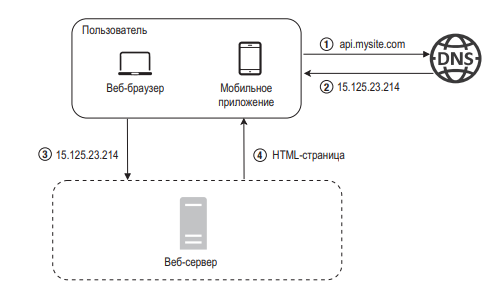
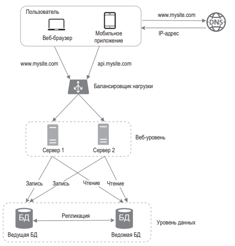
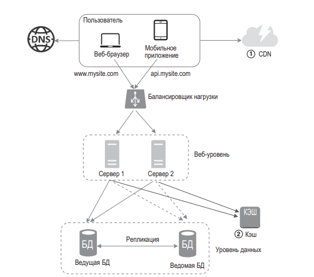
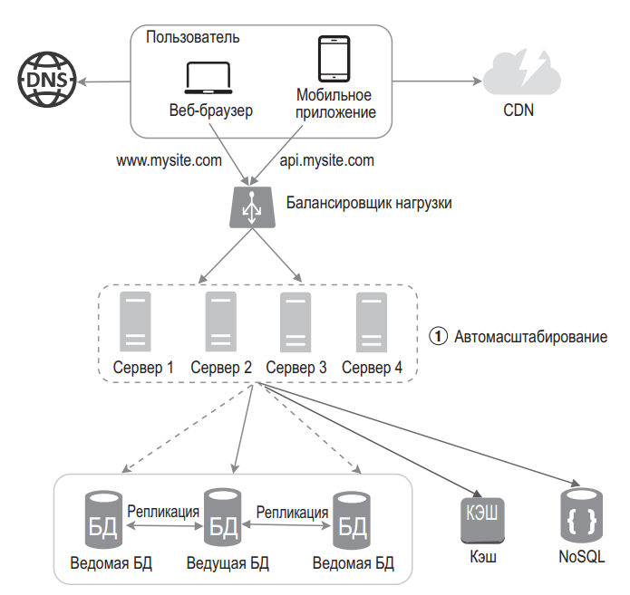
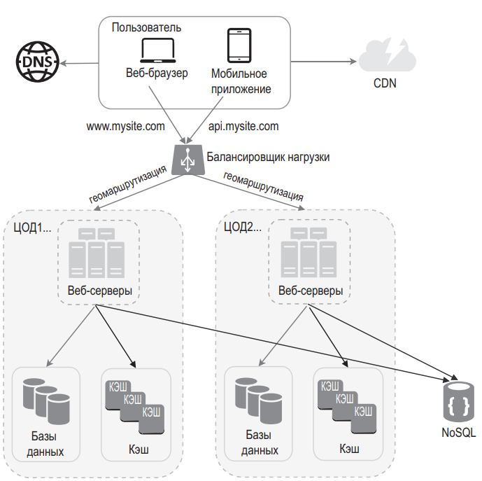

# 🏛️ System Design — Алекс Сюи

## 💡 Об Авторе
 Алекс Сюи - опытный разрабочик программного обеспечения который поработал в Apple, Twitter, Oracle. Его страсть проектировать сложные системы.
## 💡 Введение
 Подготовка к сложному себеседованию потому и сложна, потому что тут нет правильных или неверных ответов. В зависимость от вводных может подойти, то или иное решение.

## 💡 Глава 1 - Масштабирование от о до миллиона
В данной главе спроектируем систему с самого начала и будем смотреть, что необходимо сделать, чтобы довести её до миллиона пользователей.

### Конфигурация из одного сервера
У нас есть система:
1. Фронт состоящий из 1)веб 2)мобильного приложения
2. У нас идёт запрос(google.com) и ответ(15.135.14.232) от DNS
3. Далее идёт обращение к серверу на котором и находиться БД

  

### База данных - Горизонтальное масштабирование - 2+ сервера
С увеличение кол-во пользователей одного сервера рано или поздно не будет хватать.
Для этого необходимо вынести БД отдельно.

#### Какую БД выбрать
БД, есть Реалиционные и Нереалиционные СУБД.
Реалиционные SQL - классический подход, когда важна целостность записи и связи между сущностями. (MySQL, PostgreSQL)
Нереалиционные NOSQL - деляться на 4 типа (а.Ключ-значение б.Графовые в.Столбцовые г.Документарные). (Neo4DB, AmazonDynamoDB, Cosandra)

#### Вертикальное и горизонтальное масштабирование
Вертикальное - это увелчичение характеристик сервера. Не предусматривает отказоустойчивость и резервирование избыточных ресурсов(например stand-by).
Горизонтальное - это увеличение колв-во серверов. 
Плюсы горизонтельного масштабирования:  и резе. 

##### Stand-in и Stand-by и отказоустойчивость
Сервер stand-in - это сервер, который заменяет другой сервер в случае его отказа. 
Сервер stand-by - это резервный сервер, который не используется в обычном режиме работы и включается только в случае отказа основного сервера.

### Балансировщик нагрузки
Когда у нас появилось 2 сервера, на необходимо перерпспределять трафик. Для этого нужен балансировщик.
К балансировщику обращются с внешнего IP, а он уже обращается к локальным IP серверам.
Балансировщик поможет: 1. Когда один сервер упал перенаправление идёт на второй 2. Когда слишком большая нагрузка, то идёт равномерное распредление нагрузки 3. Нет прямого взаимодействия с серварами, а только через балансировщик.

### Реприкация БД
Может использовать в различных СУБД в режиме ведущий-ведомый, master-slave.

Обычно одна master БД и например 3 slave БД.
К Slave БД можно обращаться для чтения с них данных. Так делается потому что чаще всего надо достать инфо, а не что-то записать.
К Master БД можно обращаться с любой операцией.
Внутри этой системы проиходит реприкация данных из Master в Slaves и обратно. 
В случае если одна из БД упадет, её заменит другая БД. Так Master БД может заменить Slave и т.д.

Репликации БД нужны: 1.Повысить производительность 2. Обеспечить надежное хранение данных даже если одну из БД потеряем.

  

### Кеш
Это выделенна область памяти, которая хранит в себе данные, запросы. Её предназначение уменьшить латентность(задержку) выдачи информации.
Сервер обращается к КЕШ - КЕШ если имеет информацию, то отдаёт её серверу.
Если данных нет в КЕШ - КЕГ идёт к БД, записывает в себя данные и отдаёт эти данные серверу.

Обращение к серверам КЕША идёт через API на популярных языков программирования
Например

```api
SECOND = 1
cache.set('my_name', 'hi there', 3600 * SECOND)
cashe.get('my_name')
```
my_name - название функции
hi there - это то что мы туда вписываем
3600*1 секунду - это время хранения кеша

#### Аспекты использования КЕШ
1. Важно использовать КЕШ если это действительно нужно. Когда много запросов на чтение информации например.
2. Важно выбрать верное время хранения данных. Слишком короткое время - увеличит нагрузку на БД. Слишком длинное - сделает данные неактуальными.
3. Репликация данных. Нужно всегда помнить о том, что важно сохранять актуальность данныех в КЕШЕ относительно БД.
4. Использую несколько серверов КЕШ, находящихся в разных ЦОД, инача может возникнуть единная точка ошибки(SPOF - single place of failure) в случае если сервер кеша всего 1.
5. Надо правильно выбрать стратегию удаления данных при переполнении КЕШ:
Страгигии - 1) LRU(least-recently-used - Стратегия когда удаляются давно неиспользованные), 2) LTF(least-frequently-used - Стратегия когда удаляются наименее часто используемые данные) 3) FIFI(first in first out - первый пришёл первый ушёл) стратегия очереди.

### CDN 
CDN - сеть географически распределённых серверов, которая используется для доставки статического содержимого. 
Кешируют статические файлы: изображения, видео, CSS, JavaScript и т.д.

Когда пользователь посещает веб-сайт, ближайший к нему CDN сервер доставляет статическое содержимое.

У CDN принципы работы очень схожи с Кеш:
1. Если нет файла то запроси, прихрани и выдай клиенту
2. Если поступает файл то он приходит вместе с TTL(временем жизни)

#### Нюансы
- Стоимость
- Додбор подходящего время жизни кеша
- Продумать возможность сбоев CDN и в таком случае обращение к оригиналу
- Аннулирование файлов, черзе апи или версионированием.

  

### Сохранение состояния, для автомасштабирования
Чтобы сделать горизонтальное масштабирование, веб уровня нужно вынести из него состояние (например информацию о пользовательских сеансах). 
Данные сеансов рекомендуется записывать в постоянне хранилища, такие как реалиционные БД или NoSQL.
Каждый веб-сервер в кластере может запросить состояние из базы данных. Таким образом получается веб-уровень без сохранения состояния.

Архитектура с состояние состояние - не рекомендуется - 
Так как у сервераА нет данных от сервераБ. 
Проблема в том что не все балансировщики умеют верно распределять на нужный сервер пользователя, поэтому мы используем другой тип.

Архитектура без сохранения состояния
Пользовательские HTTP-запросы могут быть направлены любым веб-серверам, которые извлекают данные о состоянии для общего хранилица.
Отдельное хранилище делает систему более простой, надежной и масштабируемой.

 

### ЦОД - Центры обработки данных, для улушчения доступности и UX в различных регионах
Например:
1. Можно разделить трафик USA по geoDNS например к ближайшему центру East и West
2. А в случае если один из ЦОД недоступен, то весь трафик отправится на доступный ЦОД

Технические вопросы:
1. Эффективный инструмент перенаправления трафика, например geoDNS;
2. Синхронизация данных. Например, реализация инструментов репликации данных из одного ЦОД в другой, в случае если один из них "ляжет";
3. Тесты и развертывание. В конфигурации с несколькими ЦОД тестирование веб-сайта/приложения необходимо проводить в разных местах. Автоматические средства развертываение незаменимы в поддержании согласованности всех ЦОД.


---

## ✨ Цитаты


---

## 🤔 Мои мысли

- ...

